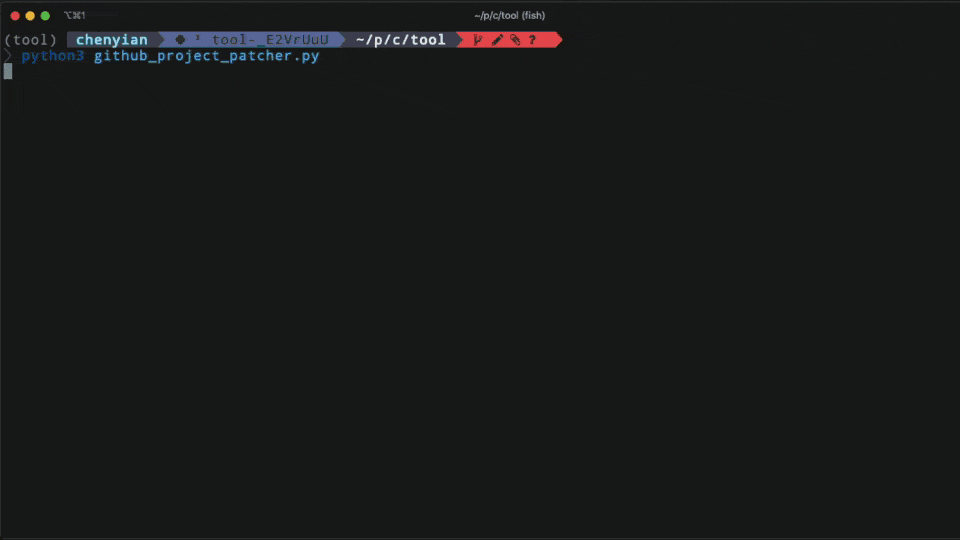
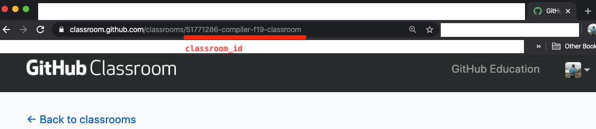
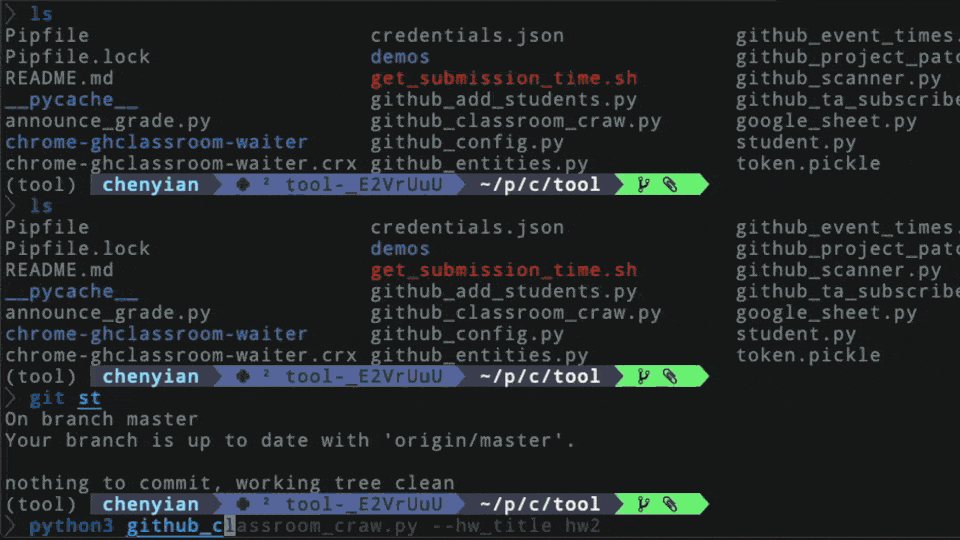
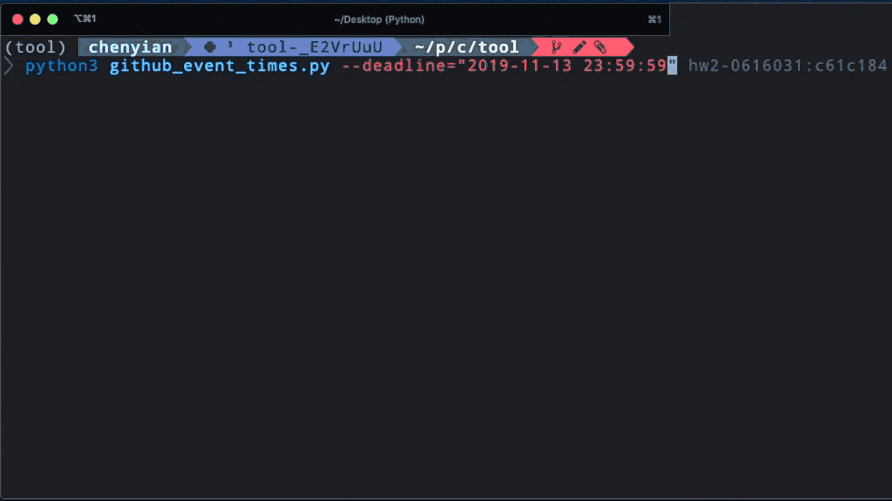

# Invisible Hand

Invisible Hand is a set of tools to manage your classroom inside github organization. It utilizes `Google Sheets` , `GitHub Classroom` and `GitHub` seamlessly.

## Installation

#### 1. Install via pip

 `pip install invisible-hand`

#### 2. Install chromedriver

* OSX

 `brew cask install chromedriver`
* Ubuntu

 `apt install chromium-chromedriver`

## Config Files

__Invisible Hand__ operates on 2 config files: `github_config.ini` and `gsheet_config.ini` .

Calling `hand` will automatically propagate these files into working directory with default template. Make sure you have configured them correctly before using them.

Additionally, if you want to use [ `Announce Grade` ](#announce-grade), follow [here](https://pygsheets.readthedocs.io/en/stable/authorization.html) to get your client secret file and rename it to __client_secret.json__

## Usage

### hand

The root command

<details>
<summary><b>Show Detail Information</b></summary>

#### Help Message

append `-h` or `--help` options get help messages

``` sh
$ hand -h
Usage: hand [OPTIONS] COMMAND [ARGS]...

    Toolkits for compiler-f19

Options:
    -h, --help         Show this message and exit.

Commands:
    add-students       student_ids: ids to add
    announce-grade     announce student grades to each hw repo
    event-times        repo-hashes : list of <repo>:<hash> strings ex:...
    grant-team-access  Add students into a github team hw-prefix: prefix for...
    patch-project      Patch to student homeworks
```

</details>

---

### Add Students

invite users into your github organization

<details><summary><b>Show Detail Information</b></summary>

#### Format

``` sh
hand add-students [github_handle]...
```

> Use `-h` to see more detailed information about this command.

github_handle: github accounts

#### Example

``` sh
hand add-students ianre657 cmprfk1 cmprfk2 cmprfk3
```

#### Config file

* github_config.ini
  + `[github]:personal_access_token`
  + `[github]:organization`
  + `[add_students]:default_team_slug`

#### FAQ

* Some students report that they didn't get the invitation email.

    Invite student into your organization from their email. This should be Github's issue.

    > about 2 of 80 students got this issue from our previous experience.

</details>

---

### Grant specific team read access to H. W. repos

Grant read access right of TA's group to students' homework repo

<details><summary><b>Show Detail Information</b></summary>

#### Config File

* __github_config.ini__:
  + `[grant_read_access]:reader_team_slug` : team slug of your TA's group

#### Format

``` shell
hand grant-read-access <hw_title>
```

#### Example

``` shell
hand grant-read-access hw3
```

</details>

---

### Patch Project

Patch to student homework repositories.

<details><summary><b>Show Detail Information</b></summary>

#### Config File

* __github_config.ini__:
  + `[github]:personal_access_token`
  + `[github]:organization`
* __gsheet_config.ini__
  + `[google_spreadsheet]:spreadsheet_url`

#### Format

``` sh
hand patch-project <hw_title> [--only-repo] <patch_branch>
```

> Use `-h` to see more detailed information about this command.

Below is the standard workflow to follow.

#### Workflow

take homework : __ `hw3` __(the title of your homework in github classroom) for example:

1. The repo __ `tmpl-hw3` __ would be your template for initializing homeworks.
2. Create another repo to update your template, let's say: __ `tmpl-hw3-revise` __
3. Inside __ `tmpl-hw3-revise` __, create a revision branch __ `1-add-some-new-feature` __ (whatever you like) and an issuse named as the branch name (in this example, __ `1-add-some-new-feature` )__, which will be the content of your PR message.
4. Open github-classroom, choose your assignment (__ `hw3` __) and disable `assignment invitation URL` of __ `hw3` __.
5. Create an PR to your template repo (__ `hw3` __) by using this command.

    

``` sh
    hand patch-project hw3 --only-repo="tmpl-hw3" 1-add-some-new-feature
    ```

6. Accept the PR in your template repository (__ `tmpl-hw3` __). After that, enable the `assignment invitation URL` of `hw3` in GitHub Classroom. Now you have succcessfully updated your template repo.
7. Create PRs to students template repositories ( `hw3-<their github id>` ) by running the scirpt as followed.

    

``` sh
    hand patch-project hw3 1-add-some-new-feature
    ```

    This script would patch to every repository that uses __hw3__ as the prefix under your GitHub organization.

8. Merge the revision brnach __ `1-add-some-new-feature` __ into `master` in your __ `tmpl-hw3-revise` __ repo. After this step, all documents are updated.

#### Demo (Deprecated)



</details>

---

### Crawl Classroom

Crawling homework submission data from Github Classroom

<details><summary><b>Show Detail Information</b></summary>

This is a web crawler for Github Classroom, which is the input of [ `Event Times` ](#event-times)

#### Config File

* __github_config.ini__:
  + `[crawl_classroom]:login` : your login id in Github Classroom
  + `[crawl_classroom]:classroom_id` : the id field of your classroom RESTful page URL. (see the image below)

    

#### Format

``` sh
hand crawl-classroom [OPTIONS] HW_TITLE OUTPUT
```

> Use `-h` to see more detailed information about this command

#### Example

``` shell
hand crawl-classroom --passwd=(cat ~/cred/mypass) hw5 hw5_handle.txt
```

> This example suppose you use Fish Shell and store your password inside `~/cred/mypass`
Users should type their passsword inside the pop-up window if they don't provide their password in the argument

#### FAQ

* ChromeDriver

  

``` 
  selenium.common.exceptions.SessionNotCreatedException: Message: session not created: This version of ChromeDriver only supports Chrome version 79
  ```

  upgrade your chromedriver via `brew cask upgrade chromedriver`
* All students not submitted
  + Remember to set deadline of hw on the GitHub classroom (note that deadline can only be set at a future time)

#### Demo



</details>

---

### Event Times

Retrieve information about late submissions

<details><summary><b>Show Detail Information</b></summary>

#### What it actually does

Compare the last publish-time of specific git commit in each repository and print out which passed the deadline.

#### Config File

* __github_config.ini__:
  + `[event_times]:deadline` deadline for homework, in ISO8601 compatible format.

    For example `2019-11-12 23:59:59` (the timezone is set to your local timezone as default).

#### Format

``` sh
hand event-times <input_file> [--deadline="yyyy-mm-dd"]
```

__input-file__: file contains list of `repo-hash` .

__repo-hash__ : in the format of `<repo>:<git commit hash>` , (for example: hw0-ianre657:cb75e99)

Github API use the first 7 characters of a commit's SHA-1 value to communicate, so the hash we used here is in the length of 7.

> The input pairs `repo:hash` could be retrieve from [ `Crawl Classroom` ](#crawl-classroom).

__ `--deadline` __: it will use the variable inside `github_config.ini` as default.

__ `--target-team` __ (optional): teams to operate on (use team-slug)

#### Example

``` sh
hand event-times  --target-team="2020-inservice-students" --deadline="2019-11-12 23:59:59"  hw1-handin-0408.txt
```

#### Demo (need to be updated)



</details>

---

### Announce Grade

Publish feedbacks by creating Issue to student's homework repo.

<details><summary><b>Show Detail Information</b></summary>

#### Explanation

In every homework project, we would create a git repository for every student. Take homework `hw3` with two students `Anna` and `Bella` for example, we expect there would be two repos under our github organization, which is `hw3-Anna` and `hw3-Bella` .
During our grading process, T. A.s would record every grade in a google sheet with a tab named `hw3` and a markdown file for each student in every assignment as their feedbacks.
After their homeworks being graded, we use this code to publish student's grade by creating `Issue` s named `Grade for hw3` to each of their github repositories.

The markdown file for feedbacks contains python template strings, and those strings are the column names inside our google sheet tab `hw3` . One template string we used is students grades, this makes managing grades more easily.

To use this code, you need to fufill some assumptions.

Lets say you're about to announce the grade for `hw3` :

* prequisite:
  1. a git repo to store student feedback templates, which strutured as followed:

``` bash
  . Hw-manager # root of your git repo
  ├── hw3
  │   └── reports
  │       ├── 0411276.md
  │       ├── 0856039.md
  │       └── 0956323.md
  └── hw4 # other homework dir
```

and inside `0411276.md` , it would be:

``` markdown
  # Information

  + Student Id: ${student_id}
  + Grade : ${grade}

  # <Some other important things...>
  ...
```

  2. a google sheet to store student information

    | student_id | grade |
    | :--------: | :---: |
    |  0856039   |  93   |
    |  0411276   |  80   |

#### Config file

* __github_config.ini__
  + `[github]:personal_access_token`
  + `[github]:organization`
  + `[announce_grade]:feedback_source_repo` (e.x.: Hw-manager)
* __gsheet_config.ini__
  + `[google_spreadsheet]:spreadsheet_id`
* __client_secret.json__ (follow [here](https://pygsheets.readthedocs.io/en/stable/authorization.html) to download your oauth2 secret file and renamed it to __client_secret.json__)

#### instructions to follow

1. Edit config files properly.
2. Create feedbacks for students in your `feedback_source_repo`
3. use this script

#### Format

``` sh
hand announce-grade <hw_title> [--only-id <student_id>]
```

option:

`--only-id` : only patch to this student id

#### Example

``` sh
hand announce-grade hw3 --only-id 0411276
```

</details>

---
