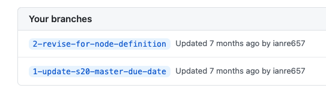
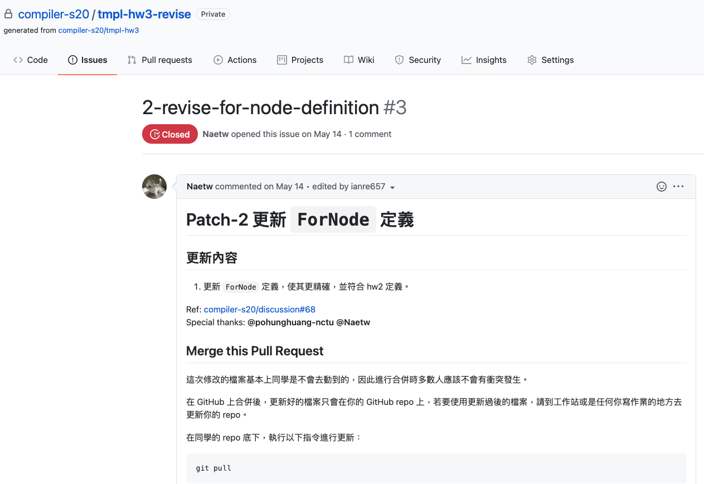
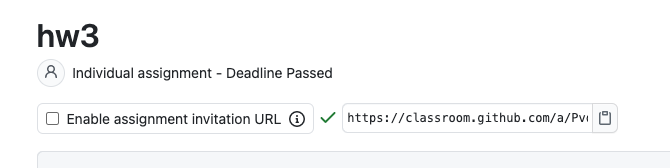
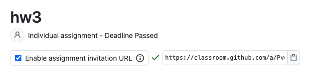

# Invisible Hand 👊

Invisible Hand helps you manage your classroom under Github organization.<br>
It utilizes `Google Sheets` , `GitHub Classroom` and `GitHub` seamlessly.

## Installation

#### 1. Install this tool via pip

 `pip install invisible-hand`

 Use `hand -h` to test if it is installed

```
╰─❯ hand -h
Usage: hand [OPTIONS] COMMAND [ARGS]...

  Manage your classroom under Github organization.

Options:
  --custom-base TEXT    Use custom base folder for configs
  --install-completion  Install completion for the current shell.
  --show-completion     Show completion for the current shell, to copy it or
                        customize the installation.

  -h, --help            Show this message and exit.

Commands:
  add-students       Invite students to join our Github organization
  announce-grade     Announce student grades to each hw repo
  config             Config File utilities
  crawl-classroom    Get student's submissions from Github Classroom
  event-times        Retrieve information about late submissions <repo-
                     hash>...

  grant-read-access  Make TAs being able to read all homework repos...
  patch-project      Patch to student homeworks
```

#### 2. Install chromedriver

* Mac : `brew cask install chromedriver`
* Ubuntu : `apt install chromium-chromedriver`

## Getting Started

**1. Create config file**

The main config file is located in `$HOME/.invisible-hand/config.toml`. <br>
Run `hand config create` to create a template and use `hand config edit` to open it with an editor.

**2. `(Not required)` Getting your `client_secret.json` for accessing GoogleSheets**

To run the command:[ `Announce Grade` ](#announce-grade), follow the steps below to setup your environment first

1. Follow [Authorization for pygsheets][pygsheet-auth] to get your credential file (`client_secret.json`)
2. Locate your secret file and use `hand config copy-client-secret YOUR-SECRET-FILE` to copy it into the cache.

    This command would automatically rename your secret file to (`$HOME/.invisible-hand/client_secret.json`)

[pygsheet-auth]: https://pygsheets.readthedocs.io/en/stable/authorization.html

## Quick references

(This tool supports auto-completion, use `hand --install-completion` to add completion support to your shell)

+ `hand`: The root command, use `-h` to see more information
  + `config`: subcommand to handle config files, use `-h` to see more information
    + `create`: Create a config file from template to `$HOME/.invisible-hand/config.toml`
    + `check`: Check if the format your config file is valid
    + `path`: Show the root path to your config folder, default to `$HOME/.invisble-hand`
    + `edit`: Open your config file with your default editor. (use `--editor <your editor>` to open your another one)
    + `copy-client-secret`: Copy Google's `client_secret.json` to the cache folder.
      + use `hand config copy-client-secret -h` to see more information
  + [`add-students 🧑‍💼student1 🦸‍♂️student2 ...`][add-students]: Invite users into your GitHub organization
    + `🧑‍💼student`- GitHub handle of the student
  + `grant-read-access 📝 hw-title`:  Grant TA's group read access to all repo with such prefix.
    + `📝 hw-title`- title prefix of the homework (e.g. `hw3`)
  + [`patch-project 📝 hw-title  🚧 patch-branch`][patch-project]: Patch project to Students homeworks
  + [`crawl-classroom 📝 hw-title 📦 submission-file`][crawl-classroom]: Crawl submission status of students on GitHub Classroom
    + `📦 submission-file`- file to store submission output
  + [`event-times 📦 submission-file`][event-times]: Check if there's late submissions
  + [`announce-grade 📝 hw-title`][announce-grade]: Announce grade to students by opening issues in their repos


---

## Add Students

#### FAQ

* Some students report that they didn't get the invitation email.

    Invite student into your organization from their email. This should be Github's issue.

    > about 2 of 80 students got this issue from our previous experience.


## Patch Project

Patch to student homework repositories.

**Workflow**

Take homework : **`hw3`**(the title of your homework in github classroom) for example: <br>
The repository: **`tmpl-hw3`** would be your template for initializing homeworks.

#### 1. Create another repo with name **`tmpl-hw3-revise`** to update your template

#### 2. Inside **`tmpl-hw3-revise`**

1. Create a revision branch **`2-revise-for-node-definition`** (whatever you like)

<p align="center">

</p>

2. Create an issuse with the identiacal title **`2-revise-for-node-definition` )**
   1.  the content of that issue would become the content of your PR message.

<p align="center">

</p>

#### 3. Open GitHub Classroom

Select your assignment (**`hw3`**) and disable `assignment invitation URL` of **`hw3`**

<p align="center">

</p>

#### 4. Create an PR to your template repo (**`hw3`**)

``` sh
hand patch-project hw3 --only-repo="tmpl-hw3" 2-revise-for-node-definition
```

#### 5. Accept the PR in your template repository (**`tmpl-hw3`**)

After that, enable the `assignment invitation URL` of `hw3` in GitHub Classroom.<br>
Now you have succcessfully updated your template repo.

#### 6. Create PRs to students template repositories ( `hw3-<their github id>` )

Patch to every repository that uses **hw3** as the prefix under your GitHub organization.

``` sh
hand patch-project hw3 2-revise-for-node-definition
```

#### 7. Merge the revision branch **`2-revise-for-node-definition`** inside `tmpl-hw3`


After this step, all documents are updated

#### 8. Reactivate the invitation URL

<p align="center">

</p>


## Crawl Classroom

Crawling homework submission data from Github Classroom

This is a web crawler for Github Classroom, which is the input of [ `Event Times` ][event-times]

### Config File

* **config.toml**:
  + `[crawl_classroom]:login` : your login id in Github Classroom
  + `[crawl_classroom]:classroom_id` : the id field of your classroom RESTful page URL. (see the image below)

<p align="center">
 
</p>


### FAQ

* ChromeDriver

  ```
  selenium.common.exceptions.SessionNotCreatedException: Message: session not created:
  This version of ChromeDriver only supports Chrome version 79
  ```

    upgrade your chromedriver via `brew cask upgrade chromedriver`
  * All students not submitted
    + Remember to set deadline of hw on the GitHub classroom (note that deadline can only be set at a future time)

<p align="center">
<strong>Demo</strong><br>

</p>


## Event Times

Retrieve information about late submissions

**What it actually does**

Compare the last publish-time of specific git commit in each repository and print out which passed the deadline.


**Example**

``` sh
hand event-times  --target-team="2020-inservice-students" --deadline="2019-11-12 23:59:59"  hw1-handin-0408.txt
```


## Announce Grade

Publish feedbacks by creating Issue to student's homework repo.

This sciprt requires you to
  + Use a `GoogleSpreadSheet` to record every student's grade inside a strictly named tab.
  + Strictly structured Github repository.


**Explanation**

In our scheme, each student would get a git repository for every homework project.<br>

Take homework `hw3` with two students `Anna` and `Bella` for example.<br>
We expect there would be 2 repos under our GitHub organization, which are `hw3-Anna` and `hw3-Bella`.<br>

Annoucing the grade for `hw3` actually means to open 1 issue to `hw3-anna` and `hw3-bella` respectively.

To make sure the script correctly functions:
+ students grade should be recorded in the SpreadSheet with a tab called `hw3`.
+ You should keep a `Markdown` file for each student using their `student-id` as the filename to describe their homework result.
  + e.g. (if `Anna`'s sutdent-id is `0856039`, then `0856039.md` should record `Anna`'s overall feedbacks).
  + **Behold: `student-id` should be unique.**

**Format and Structure for those files**

+ 0856039.md (`Anna`)

  ```markdown
  Hi, @Anna

  ## Information
  + Grade: ${grade}
    + testcase : ${grade_testcase}/100 pts
    + report : ${grade_report}/5 pts

  + Grader: @{grader}
  + Feedback:
      Good Job

  ## Note
  If you got any questions about your grade
  please make a comment stating your arguments below and tag the grader in the comment.
  ```

  This markdown file contains python template strings(`${grade}`),<br>
  These strings are the column names inside your SpreadSheet tab `hw3`.

+ Structure of the GitHub Repo:
  ``` markdown
    . Hw-manager # root of your git repo (the name is configured in `$HOME/.invisible-hand/config.toml`)
    ├── hw3
    │   └── reports
    │       ├── 0411276.md
    │       ├── 0856039.md (**Anna**)
    └── hw4 # other homework dir
  ```

+ Structure of the Google SpreadSheet
  | student_id | grade | grade_report | grade_testcase | grader |
  | :--------: | :---: | :----------: | :------------: | :----: |
  |  0856039   |  93   |      5       |       87       |  @TA1  |
  |  0411276   |  80   |      5       |       75       |  @TA2  |


### Config file

* **config.toml**
  + `[github]:personal_access_token`
  + `[github]:organization`
  + `[announce_grade]:feedback_source_repo` (e.x.: Hw-manager)
  + `[google_spreadsheet]:spreadsheet_id`
* **client_secret.json** (follow [here](https://pygsheets.readthedocs.io/en/stable/authorization.html) to download your oauth2 secret file and renamed it to **client_secret.json**)

#### Instructions to follow

1. Edit config files properly.
2. Create feedbacks for students in your `feedback_source_repo`
   1. **Make sure you commit and push the feedbacks to `master` branch**
   2. Fill out the SpreadSheet
3. Use this script
   1. For testing, it's recommended to use the `--only-id` option

       ```sh
       hand announce-grade <hw_title> [--only-id 👨‍🎓student-id]
       ```


[event-times]: #event-times
[add-students]: #add-students
[patch-project]: #patch-project
[crawl-classroom]: #crawl-classroom
[announce-grade]: #announce-grade